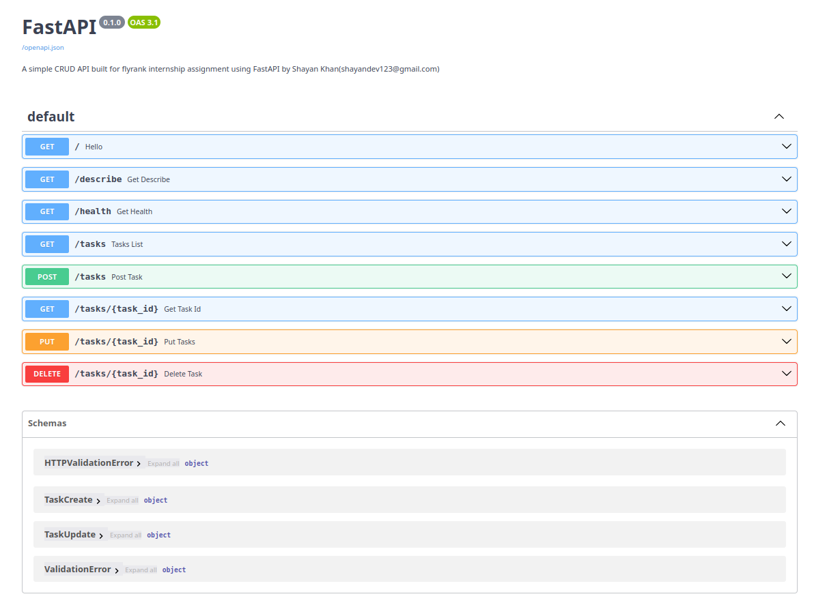
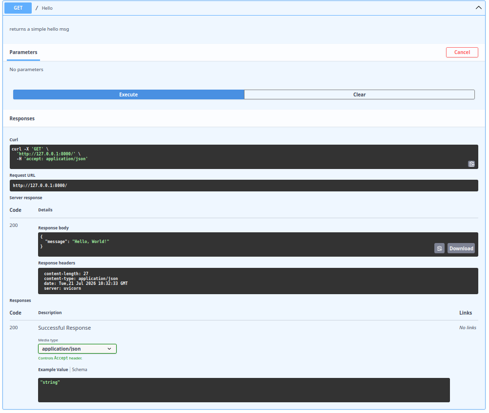
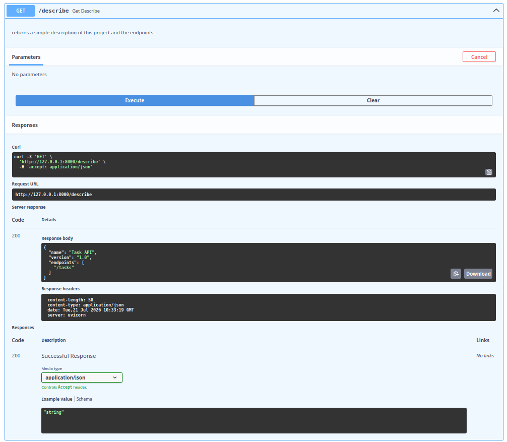
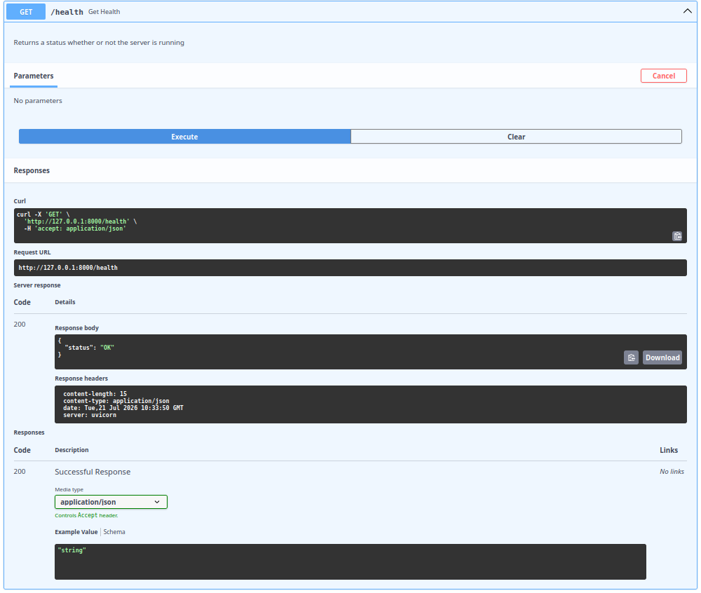
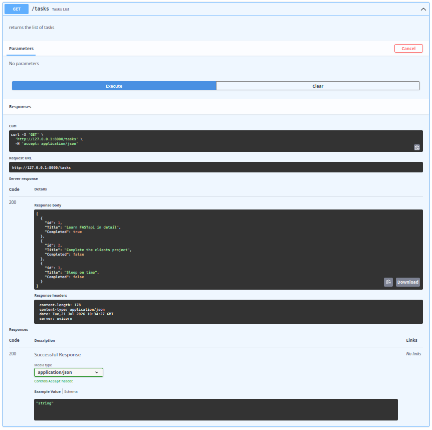
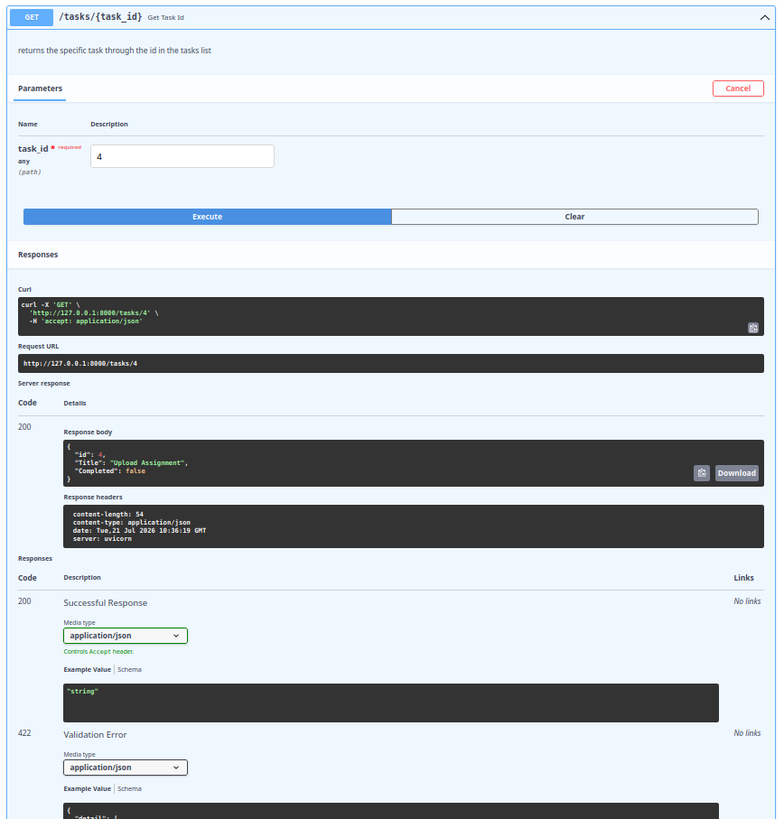
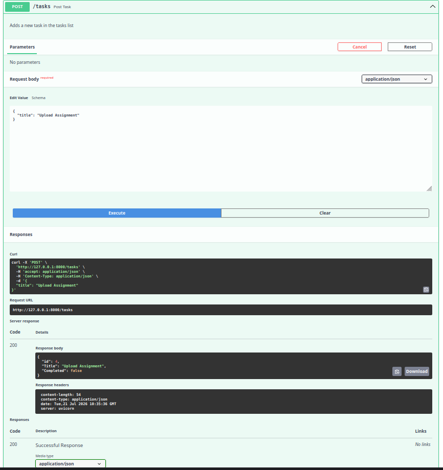
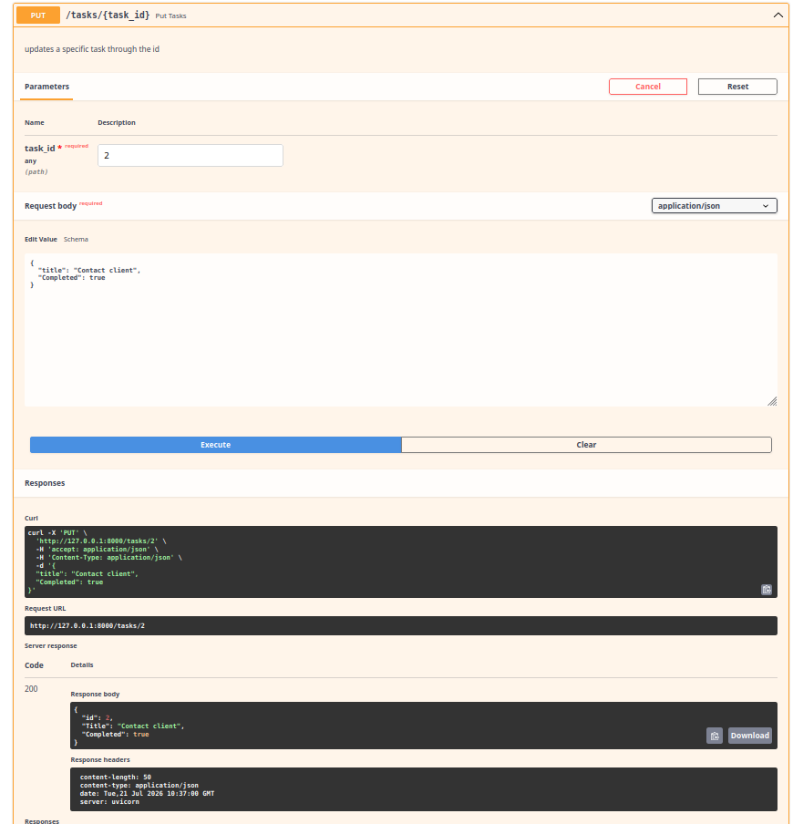

# Task API - FastAPI CRUD

A simple CRUD (Create, Read, Update, Delete) REST API built with FastAPI for the FlyRank Backend Assignment.

## Features

- Create a task
- View all tasks
- View a single task
- Update a task
- Delete a task
- Interactive Swagger documentation

---

## Installation

Clone the repository

```bash
git clone https://github.com/Shayankhan123-dev/CRUD_API_flyrank_backend_assignent1.git
cd CRUD_API_flyrank_backend_assignent1
```

Create a virtual environment

```bash
python -m venv venv
```

Activate it

Linux/macOS

```bash
source venv/bin/activate
```

Windows

```bash
venv\Scripts\activate
```

Install dependencies

```bash
pip install -r requirements.txt
```

Run the server

```bash
uvicorn main:app --reload
```

---

## Swagger Documentation

Open

```
http://127.0.0.1:8000/docs
```

---

## Endpoints

| Method | Endpoint | Description |
|---------|----------|-------------|
| GET | / | Hello World |
| GET | /describe | API description |
| GET | /health | Health check |
| GET | /tasks | Get all tasks |
| GET | /tasks/{task_id} | Get a task by ID |
| POST | /tasks | Create a task |
| PUT | /tasks/{task_id} | Update a task |
| DELETE | /tasks/{task_id} | Delete a task |

---

## curl (Note that the response pasted here is the actual response when this curl command was used)

```bash
curl -i http://127.0.0.1:8000/tasks
```

Response

```HTTP/1.1 200 OK
date: Tue, 21 Jul 2026 10:49:59 GMT
server: uvicorn
content-length: 178
content-type: application/json

[{"id":1,"Title":"Learn FASTapi in detail","Completed":true},{"id":2,"Title":"Complete the clients project","Completed":false},{"id":3,"Title":"Sleep on time","Completed":false}]
```

---

## Swagger UI
```

```
```

```
```

```
```

```
```

```
```

```
```

```
```

```

```

```

---

## Technologies Used

- Python
- FastAPI
- Uvicorn
- Pydantic